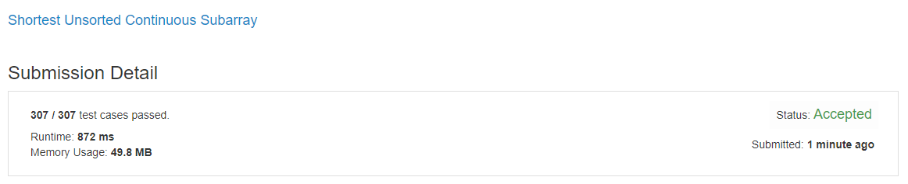

# leetCode_581
- 정렬되지 않은 숫자 배열이 주어졌을때 정렬된 배열을 만들기 위해 바뀌어야 하는 연속된 숫자의 개수를 반환하는 문제.

`https://leetcode.com/problems/shortest-unsorted-continuous-subarray/`

- Shortest Unsorted Continuous Subarray

  - Given an integer array, you need to find one continuous subarray that if you only sort this subarray in ascending order, then the whole array will be sorted in ascending order, too. You need to find the shortest such subarray and output its length.

## my Code is src/leetCode_581 in this repository
