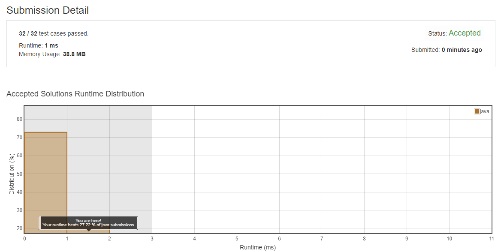

# ▷ leetCode_581
- Shortest Unsorted Continuous Subarray

  - 정렬되지 않은 숫자 배열이 주어졌을때 정렬된 배열을 만들기 위해 바뀌어야 하는 연속된 숫자의 개수를 반환하는 문제.

  `Link : https://leetcode.com/problems/shortest-unsorted-continuous-subarray/`

## my Code is src/leetCode_581 in this repository

# ▷ leetCode_852
- Peak Index in a Mountain Array

  - 산의 높이가 input으로 입력된다고 가정할때, 가장 높은 곳의 인덱스를 반환하는 문제.

  `Link : https://leetcode.com/problems/peak-index-in-a-mountain-array/`

## my Code is src/leetCode_852 in this repository

